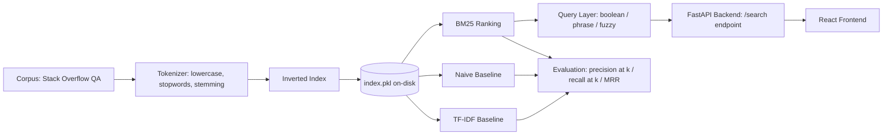

# Invertex -> from Scratch full-text Search Engine

A production-style search engine built entirely from first principles — no Elasticsearch, no Whoosh, no Lucene. Every core piece of the retrieval stack (inverted index, TF-IDF, BM25 ranking, boolean/phrase/fuzzy query parsing) is hand-written in Python, benchmarked against a naive baseline, and served through a real API and UI.

**Highlights:**
- Indexes 300,000 real-world documents (Stack Overflow Q&A) into a hand-built inverted index — 436,213 unique terms, 340 MB on disk, built in ~4.4 minutes.
- BM25 ranking beats a naive keyword-match baseline by **2.4x on precision@10** and a TF-IDF baseline by **12x**, measured on 24 manually labeled queries (precision, recall, MRR — all hand-implemented, no `sklearn`/`rank_bm25`).
- Supports boolean (AND/OR), exact phrase, and typo-tolerant fuzzy search — the fuzzy matcher uses a hand-written Levenshtein DP, debugged through two real ranking-quality bugs (see `DESIGN_DECISIONS.md`).
- End-to-end working demo: FastAPI backend + React frontend, sub-150ms query latency.

## Architecture



## Corpus

300,000 questions sampled from the Stack Overflow StackSample dataset (Kaggle), out of 1,264,216 total. HTML and code blocks stripped from indexed text; titles + prose body indexed.

## Running Locally

### Setup

```powershell
python -m venv venv
venv\Scripts\activate
pip install -r requirements.txt
python -c "import nltk; nltk.download('stopwords')"
```

### Build the index (one-time)

```powershell
python scripts\download_data.py
python scripts\build_corpus.py
python scripts\build_index.py
```

### Run the backend

```powershell
uvicorn search_engine.api.main:app --reload --port 8000
```

### Run the frontend

```powershell
cd frontend
npm install
npm run dev
```

Open `http://localhost:5173`.

## Query Features

- **Ranked search (default):** BM25, `k1=1.5`, `b=0.75`
- **Boolean:** `term1 AND term2`, `term1 OR term2`
- **Phrase:** `"exact phrase match"`
- **Fuzzy:** automatic fallback when no query term matches the vocabulary (edit-distance correction against the stemmed vocabulary, ranked by document frequency)

## Evaluation Results

Naive keyword-match baseline vs. hand-written TF-IDF vs. hand-written BM25, evaluated on 24 manually labeled queries, k=10:

| Method | Precision@10 | Recall@10 | MRR |
|---|---|---|---|
| Naive baseline | 0.302 | 0.276 | 0.345 |
| TF-IDF | 0.062 | 0.084 | 0.153 |
| BM25 | 0.737 | 1.000 | 0.951 |

BM25 outperforms the naive baseline by ~2.4x on precision@10 and TF-IDF by ~12x. Full results in `data/eval_results.md`.

## Design Decisions

See `DESIGN_DECISIONS.md` for the full log of engineering decisions, tradeoffs, and bugs fixed during development (phase by phase).

## Tech Stack

Python 3.11+, FastAPI, React (Vite), NLTK (stopwords/stemming primitives only — no search/ranking libraries), pickle (index serialization).
